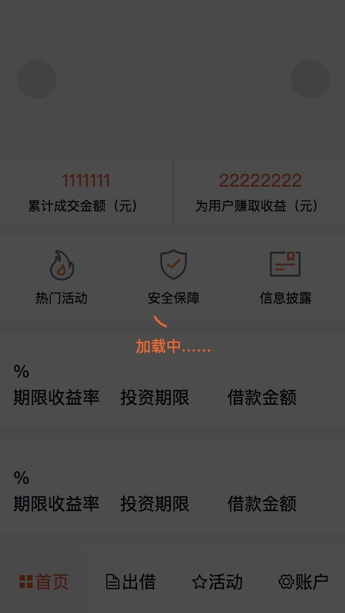

# app

### 安装

	git clone git@github.com:luguanrui/newapp.git
	
	cd newapp
	
	npm install
	
	npm run dev

### 样式展示

### elementUI主题色修改

    npm i element-theme -g
    
    npm i element-theme-chalk -D
    
    et -i [可以自定义变量文件]
    
    element-variables.scss修改变量
    
    et
    
    import '../theme/index.css'
    
    import ElementUI from 'element-ui'
    
    import Vue from 'vue'
    
    Vue.use(ElementUI)

### 路由懒加载

router/index.js

	import Vue from 'vue'
	import Router from 'vue-router'	
	Vue.use(Router)
	export default new Router({
		mode: 'history', // 默认hash
  		routes: [
  			{
	  			path: '/index',
	      		name: 'Index',
	      		component: resolve => {require(['components/index/index'], resolve)}
  			},
  			...
  		]
	})
	
懒加载的作用：将页面进行划分，需要加载的时候再加载

### 加上index.html加上shortcut失效

  1、根目录下加入图标，
  
  2、在build/webpack.dev.conf.js中添加favicon
  
     new HtmlWebpackPlugin({
        filename: 'index.html',
        template: 'index.html',
        inject: true,
        favicon:'./favicon.ico'
      }),
      
### 图形验证码

[自定义组件](https://github.com/luguanrui/vue-img-verify)

### 参数传递

传递参数：this.$router.push({path: '/findpwdNext', query: {phone:'0000'}})

接收参数：this.$route.query.phone

### 说明

目前接口服务器已停

